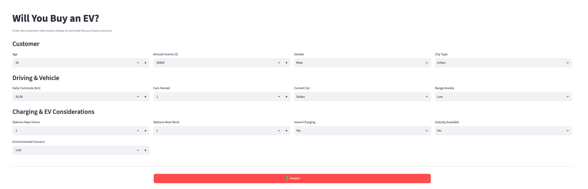

# Will You Buy an EV?

An end-to-end machine learning project for predicting EV purchase likelihood, including data preprocessing, feature engineering, model training, and evaluation.

---

## Overview

This project predicts **whether a given customer will buy an electric vehicle (`Will_Buy_EV`)**, based on demographic, behavioral, and infrastructure-related features like income, environmental concern, subsidy availability, range anxiety, and charging access. The data comes from [Electric Vehicle purchase information](https://www.kaggle.com/competitions/playground-series-s6e9).

The data has its own quirks and patterns, which made it a good test for practicing the parts of a modeling project that actually matter: careful EDA, thoughtful preprocessing, feature engineering, model tuning, and interpretability. Models are evaluated using **ROC AUC**.

This repo isn't just a notebook with a `.fit()` call. It's structured like a project meant to be run, reproduced, and extended:

- 📊 **EDA & feature engineering** in Jupyter, backed by a reusable Python package
- 🤖 **Multiple gradient-boosting models** (LightGBM, XGBoost, CatBoost) benchmarked against each other
- 🔍 **Model interpretability** via SHAP
- 📈 **Experiment tracking** with Weights & Biases
- ⚙️ A **Makefile-driven pipeline** (`download → train → inference`) so the whole project runs with one command
- 📦 Modern Python tooling (`uv`, `pyproject.toml`, `ruff`) instead of a loose pile of scripts

## Results

The final model achieved a **ROC AUC of 0.94**. Full EDA and SHAP-based interpretability plots live in the [`notebooks/`](notebooks) directory, with exported figures in [`figures/`](figures).

## Live Demo

[Check out the live dashboard](https://will-you-buy-an-ev.streamlit.app/) if you want to test the model out yourself!

[](https://will-you-buy-an-ev.streamlit.app/)

## Project Structure

```
will-you-buy-an-ev/
├── figures/                             # Exported plots (EDA, correlations, SHAP, etc.)
├── notebooks/
│   ├── eda.ipynb                        # Exploratory data analysis
│   └── interpretability.ipynb           # SHAP-based model interpretability
├── src/will_you_buy_an_ev/
│   ├── config/
│   │   ├── paths.py                     # Centralized file/directory paths
│   │   └── sweep.py                     # W&B sweep configuration
│   ├── data/
│   │   ├── download.py                  # Pulls the competition dataset from Kaggle
│   │   ├── feature_engineer.py          # Feature engineering
│   │   └── preprocess.py                # Cleaning and preprocessing
│   ├── hyperparameters/
│   │   ├── tune.py                      # Hyperparameter search (via W&B sweeps)
│   │   └── best_parameters.py           # Best parameters found per model
│   └── model/
│       ├── cross_validation.py          # Cross-validation logic
│       ├── selection.py                 # Model selection across LightGBM/XGBoost/CatBoost
│       ├── train.py                     # Trains the final model
│       └── inference.py                 # Runs inference / evaluation
├── .env.example                         # Template for Kaggle & W&B credentials
├── Makefile                             # Commands to install → download → train → inference
├── pyproject.toml                       # Dependencies & project metadata (managed with uv)
└── uv.lock
```

## Tech Stack

| Category | Tools |
|---|---|
| **Modeling** | LightGBM, XGBoost, CatBoost, scikit-learn |
| **Interpretability** | SHAP |
| **Experiment tracking** | Weights & Biases |
| **Data** | pandas, NumPy, KaggleHub |
| **Visualization** | Matplotlib, Plotly, Kaleido |
| **Tooling** | uv (dependency management), Ruff (linting), python-dotenv |

## Setup & Running

### Prerequisites

- Python **3.14+**
- [`uv`](https://docs.astral.sh/uv/getting-started/installation/) for dependency management
- A [Kaggle](https://www.kaggle.com/) account + API token (to download the competition data)
- A [Weights & Biases](https://wandb.ai/) account (used for experiment tracking and hyperparameter sweeps)

### 1. Clone the repo

```bash
git clone https://github.com/coreymichaud/will-you-buy-an-ev.git
cd will-you-buy-an-ev
```

### 2. Configure your environment variables

Copy the example env file and fill in your credentials:

```bash
cp .env.example .env
```

```
# Kaggle
KAGGLE_USERNAME=""
KAGGLE_API_TOKEN=""

# Weights & Biases
WANDB_API_KEY=""
WANDB_ENTITY=""
WANDB_PROJECT=""
```

### 3. Install dependencies

```bash
make install
```

> **Note for macOS users:** LightGBM depends on OpenMP, which isn't bundled with the macOS toolchain. If `uv sync` succeeds but training fails with an OpenMP-related error, install it via Homebrew:
> ```bash
> brew install libomp
> ```

### 4. Run the pipeline

Everything is orchestrated through the `Makefile`:

```bash
make download    # Pulls the dataset from Kaggle
make train        # Trains the model (implies download)
make inference    # Runs inference/evaluation (implies train)

# Or, run the entire pipeline end-to-end in one shot:
make all
```

Run `make help` at any time to see all available targets.